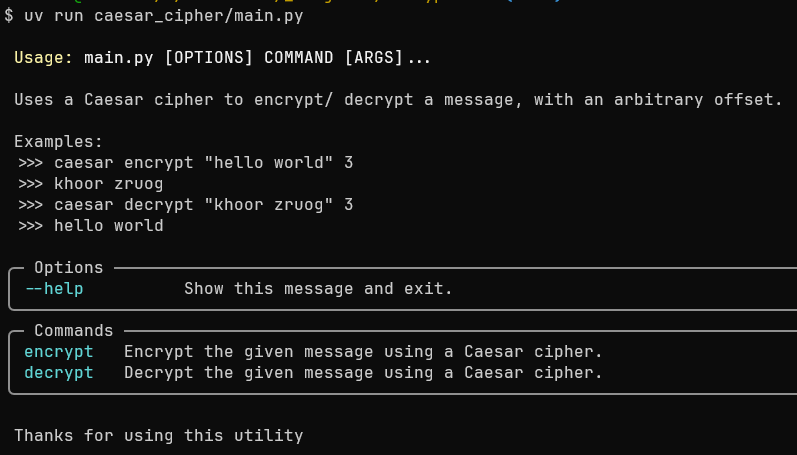
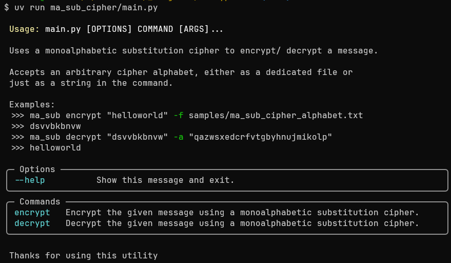
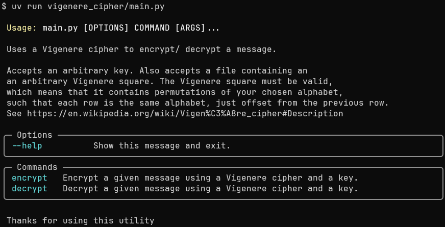

# Encryptions

Just testing out some implementations of encryptions.

## Implemented

1. Caesar cipher (with arbitrary offset)
2. Monoalphabetic substitution cipher
3. Vigenere cipher

## Inspiration

This project is inspired by *The Code Book* by Simon Singh.

## Running

Each cipher is implemented as its own [Typer](https://typer.tiangolo.com/) project.

Install the project dependencies into a virtual environment.

Optionally install each of the projects themselves with:
```bash
  pip install -e .
```

This project was created using [UV](https://docs.astral.sh/uv/), but `pip` can be used too.

Run each app with:

```bash
    <folder>/main.py
```

or, if you installed the apps via pip:

```bash
    <app>
```

Each app is individually well-documented.

## Screenshots

The Caesar cipher app:



The monoalphabetic substitution cipher app:



The Vigenère cipher app:


